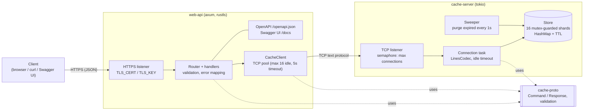
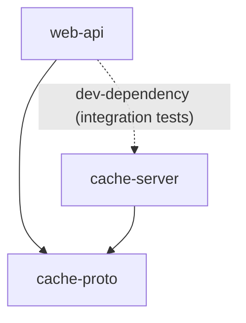
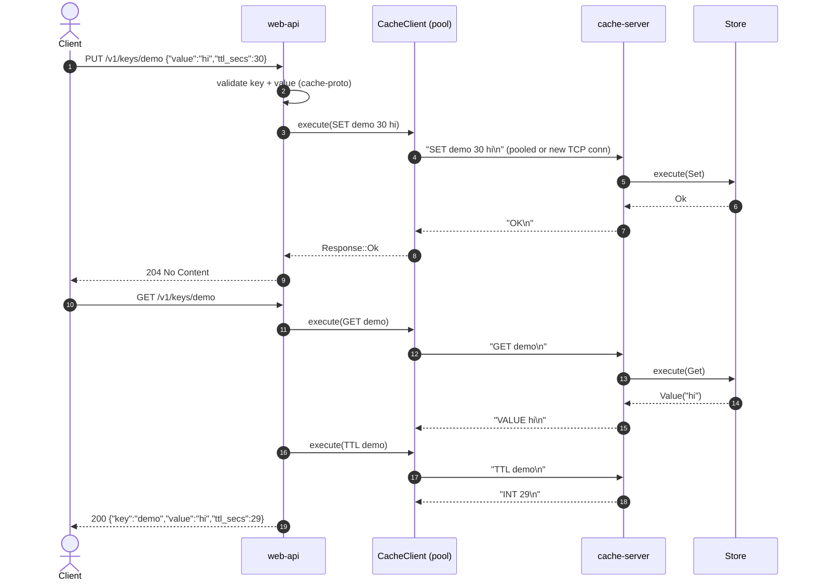
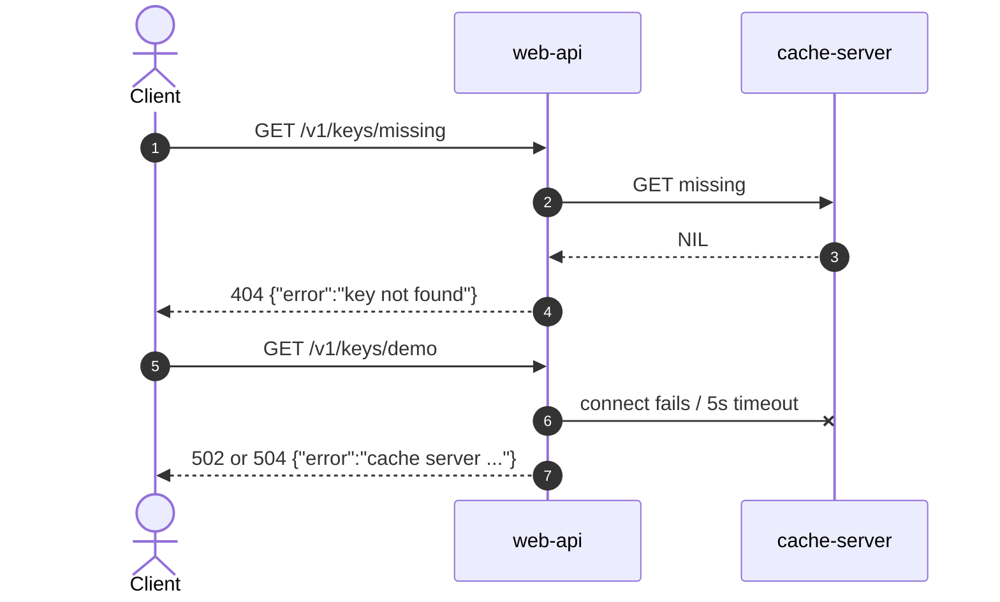
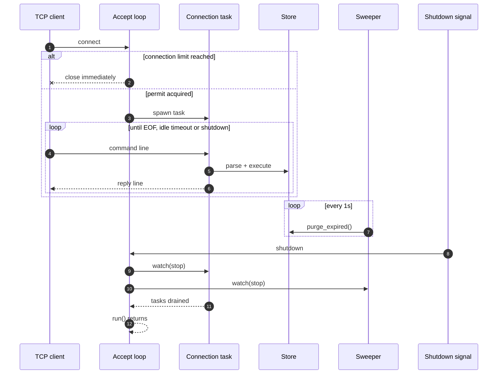
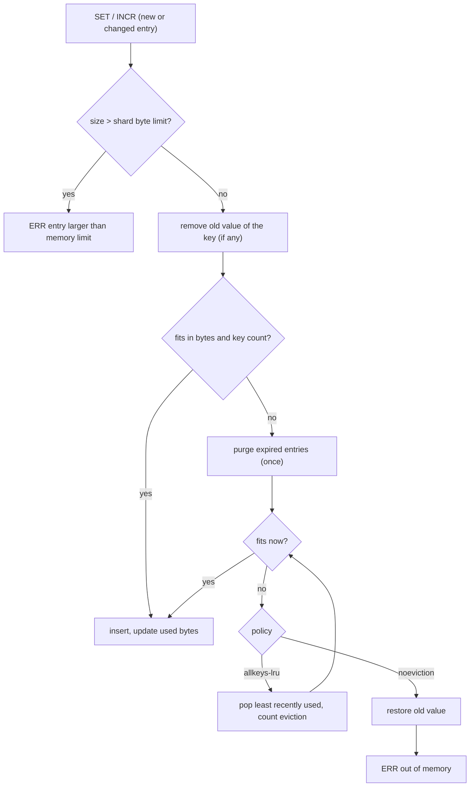

# RustCache – Technical Design Document

_Last updated: 2026-10-03 (LRU eviction and byte-based memory limits). Maintained via the `update-tdd` skill (`.github/skills/update-tdd/SKILL.md`); update it whenever code or design changes._

## 1. Overview

RustCache is a Redis-like in-memory cache written in Rust. It is two applications in one Cargo workspace:

- **cache-server**: owns the data, serves a text protocol over TCP.
- **web-api**: HTTPS API (axum) that translates HTTP calls into TCP commands to cache-server.

### Goals
- Low-latency in-memory key/value cache with TTLs.
- Safe, bounded resource usage (connections, keys, memory bytes with LRU eviction, key/value sizes, line length).
- Clean separation: protocol, store, transport, HTTP API.

### Non-goals (currently)
- Redis RESP compatibility, persistence, replication/clustering, authentication on the TCP port, other eviction policies (LFU, random, TTL-based).

## 2. Architecture

### 2.1 Application architecture

### 2.2 Crate dependencies

| Crate | Responsibility |
|---|---|
| `cache-proto` | `Command`/`Response` types, parse/encode, key/value validation and size limits. No I/O. |
| `cache-server` | `store` (data + TTL), `server` (accept loop, connection handling, shutdown), `main` (env config). |
| `web-api` | `client` (TCP pool), `lib` (axum router, handlers, error mapping), `main` (TLS, shutdown). |

### 2.3 Sequence diagrams

**Write then read through the HTTPS API** (`PUT` then `GET` with TTL):

**Error paths** (missing key, cache unavailable):

**TCP connection lifecycle and graceful shutdown** (cache-server):

### 2.4 Code documentation

Every type, enum variant, struct field, function and method (public and private) has a rustdoc comment; functions list their parameters (`# Arguments`) and failure modes (`# Errors`) where relevant. Generate the browsable reference with `cargo doc --workspace --no-deps --document-private-items --open`. Doc comments on the API handlers and JSON body types also feed the OpenAPI spec, so keep them user-facing.

## 3. Wire protocol (cache-proto)

Line-based text, one request and one reply per line (`\n` or `\r\n`), commands case-insensitive.
Full command table lives in [README.md](README.md#tcp-protocol).

- Keys: non-empty, <= 256 bytes, no whitespace/control characters.
- Values: remainder of the line, <= 1 MiB, no CR/LF.
- `SET <key> <ttl_secs|-> <value>`: `-` means no expiry.
- Replies: `OK`, `PONG`, `VALUE <v>`, `NIL`, `INT <n>`, `ERR <msg>`.
- Max request line: `MAX_LINE_LEN` (value + key + 64); longer lines get `ERR request too large` and the connection closes.

Design note: a text protocol was chosen for simplicity and debuggability (e.g. `nc`); values are UTF-8 strings only, binary values are unsupported.

## 4. Store (cache-server/src/store.rs)

- 16 shards chosen by `DefaultHasher`; each is a `Mutex<Shard>` where `Shard { map: LruCache<String, Entry>, used: usize }` (the `lru` crate, unbounded; limits are enforced by the store). `Entry { value, expires_at: Option<Instant> }`.
- Std mutexes, never held across `.await`; poisoned locks are recovered (map stays consistent).
- **Expiry**: lazy (checked on read/write) plus background `purge_expired` sweep every `sweep_interval` (1s).
- **TTL semantics**: `TTL` returns remaining seconds rounded up, `-1` no expiry, `-2` missing/expired. `INCR` creates missing keys at 1, preserves existing TTL, errors on non-integers and overflow.
- Time is injectable (`execute_at`) for deterministic tests.

### 4.1 Memory accounting and limits
- Entry size = key bytes + value bytes + `ENTRY_OVERHEAD` (64, an estimate of per-entry bookkeeping). `Shard.used` is updated on every insert, replace, delete, expiry and eviction; `Store::used_memory()` sums it.
- Limits: `max_memory_bytes` and `max_keys`, each divided evenly across shards (rounded up, minimum 1). An entry bigger than the shard byte budget is always rejected (`ERR out of memory: entry is larger than the memory limit`).
- Accounting is an approximation of heap use (allocator and hash-table overhead are not measured), so size `CACHE_MAX_MEMORY_BYTES` below the process's real memory budget.

### 4.2 Eviction policy
`EvictionPolicy` (`CACHE_EVICTION_POLICY`):

| Policy | Behaviour when a write does not fit |
|---|---|
| `allkeys-lru` (default) | `make_room`: purge expired entries in the shard, then pop least-recently-used entries until the new entry fits; each pop increments `Store::evicted_keys()`. |
| `noeviction` | After purging expired entries, reject with `ERR out of memory: memory or key limit reached` (HTTP 422). Existing data is unchanged, including the old value of a key being overwritten. |

Recency: `GET`, `SET` and `INCR` promote a key; `EXISTS`, `TTL`, `EXPIRE` do not. Writes replacing an existing key are checked against the net change in size.

Known limitations: eviction is shard-local (a hot shard can evict while others have space); purging expired entries scans a shard (O(n) under its lock, only when under pressure and on the sweep); there is no `INFO`/metrics command yet to read `used_memory`/`evicted_keys` remotely.

## 5. TCP server (cache-server/src/server.rs)

- `run(listener, config, shutdown_future)`: accept loop in `tokio::select!`; one task per connection tracked in a `JoinSet`.
- `Framed<TcpStream, LinesCodec>` with a max line length handles partial reads/writes.
- **Limits**: `max_connections` via semaphore (excess connections are dropped immediately), per-connection idle timeout.
- **Graceful shutdown**: on the shutdown future, stop accepting, signal connections and the sweeper via a `watch` channel, and wait for them to finish.
- Malformed commands reply `ERR ...` and keep the connection open.
- Configuration (env): `CACHE_ADDR`, `CACHE_MAX_CONNECTIONS`, `CACHE_MAX_KEYS`, `CACHE_MAX_MEMORY_BYTES`, `CACHE_EVICTION_POLICY`, `CACHE_IDLE_TIMEOUT_SECS`. An unparsable `CACHE_EVICTION_POLICY` aborts startup; other unparsable values fall back to defaults.

## 6. Web API (web-api)

### Routes
See [README.md](README.md#https-api). Each handler validates the key (and value) with `cache-proto` before touching the network, then issues one or two TCP commands (`GET` also issues `TTL`).

### OpenAPI / Swagger
The spec is generated from code: handlers carry `#[utoipa::path]` annotations, request/response types derive `ToSchema`, and `ApiDoc` (in `web-api/src/lib.rs`) aggregates them. The router serves the spec at `GET /openapi.json` and Swagger UI at `/docs` (`utoipa-swagger-ui`, assets embedded in the binary). Both are unauthenticated like the rest of the API. Adding or changing a route requires updating its `#[utoipa::path]` and the `ApiDoc` paths/schemas list; `serves_openapi_and_swagger_ui` checks that the documented paths exist.

### TCP client pool (`client.rs`)
- Up to 16 idle `BufReader<TcpStream>` connections reused; a failed pooled connection falls back to a fresh connect.
- 5s timeout for connect and for each request/response exchange.

### Error mapping
| Condition | HTTP |
|---|---|
| Invalid key/value/body | 400 |
| Missing key | 404 |
| Cache replied `ERR` (e.g. INCR on text, out of memory) | 422 |
| Cache unreachable / bad reply | 502 |
| Cache timeout | 504 |
| `/healthz` with cache down | 503 |

Bodies are JSON `{"error": "..."}`. Request body limit: 2 MiB.

### TLS
HTTPS via `axum-server` + rustls using PEM files from `TLS_CERT`/`TLS_KEY`. The app refuses to start without them unless `WEB_ALLOW_HTTP=1` (development only). Ctrl-C triggers a 10s graceful shutdown.

## 7. Security considerations

- The TCP port has **no authentication or encryption**; bind it to loopback or a private network and expose only web-api publicly.
- The web-api currently has **no authentication or rate limiting**; add before any public exposure.
- Inputs are validated and bounded at both layers; CR/LF in values is rejected to prevent protocol injection.
- No secrets in the repo; `certs/` is git-ignored.

## 8. Testing strategy

- Unit tests: protocol parsing/roundtrips, store semantics (TTL via injected time, INCR, memory accounting, LRU order, multi-eviction, expired-first, noeviction rollback, oversized entries, key limit).
- Integration tests: `cache-server/tests/tcp.rs` (commands, partial writes, expiry, connection limit, graceful shutdown); `web-api/tests/api.rs` (full stack on ephemeral ports, cache-down behaviour, OpenAPI spec and Swagger UI served).
- Gate: `cargo fmt --all`, `cargo clippy --workspace --all-targets -- -D warnings`, `cargo test --workspace`.

## 9. Open items / future work

- More eviction policies (LFU, volatile-only), a global (non-per-shard) memory budget, and an `INFO` command / API endpoint exposing `used_memory` and `evicted_keys`.
- Authentication (TCP + API), rate limiting, metrics and tracing exports.
- Binary-safe values; optional RESP compatibility; persistence (snapshots/AOF).
- Pipelining and async connection multiplexing in the API client.
